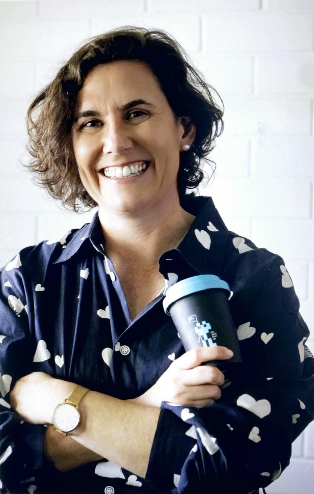
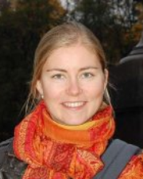
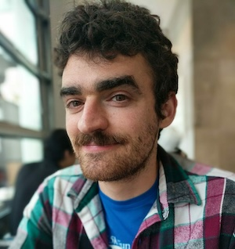
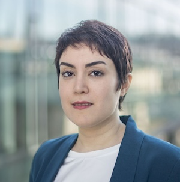

We are very excited to announce the second Workshop on Generative AI and Law (GenLaw '24)! Please join us in Vienna, Austria at [ICML '24](https://icml.cc/), where we'll be bringing together experts in privacy, ML, policy, and law to discuss the intellectual property (IP) and privacy challenges that generative AI raises with a special focus on UK and EU issues. 

Read our [report](https://genlaw.org/2023-report.html) from last year, an explainer on [training dataset curation](https://genlaw.org/explainers/training-data.html), and a piece on the [copyright issues](https://genlaw.org/explainers/talkin.html) generative AI raises. 

<figure>
    
  </figure>

<!-- ### Dates: -->

<table class="dates">
  <tr>
    <td>
Workshop date:
</td>
    <td class="time">
<time datetime="2024-07-27">27 July 2024</time>
</td>
  </tr>
  <tr>
    <td>
Paper submission deadline (<a href="2024-icml/cfp.html">CFP</a>):
</td>
    <td class="time">
<time datetime="2024-06-10">11 June 2024</time>
</td>
  </tr>
</table>

### About GenLaw

Progress in generative AI depends not only on better model architectures, but on terabytes of scraped Flickr images, Wikipedia pages, Stack Overflow answers, and websites. 
But generative models ingest vast quantities of intellectual property (IP), which they can memorize and regurgitate verbatim. Several recently-filed lawsuits relate such memorization to copyright infringement. 
These lawsuits will lead to policies and legal rulings that define our ability, as ML researchers and practitioners, to acquire training data, and our responsibilities towards data owners and curators. 

AI researchers will increasingly operate in a legal environment that is keenly interested in their work --- an environment that may require future research into model architectures that conform to legal requirements. 
Understanding the law and contributing to its development will enable us to create safer, better, and practically useful models.
<!-- Addressing these challenges requires collaboration between ML researchers and practitioners, data curators, HCI researchers, and legal experts[@cooper2022accountabiliy]. -->

### Our Workshop

We're excited to share a series of tutorials from [renowned experts](index.html#speakers) in both ML and law and panel discussions, where researchers in both disciplines can engage in semi-moderated conversation. 

Our workshop will begin to build a comprehensive and precise synthesis of the legal issues at play. Beyond IP, the workshop will also address privacy and liability for dangerous, discriminatory, or misleading and manipulative outputs. It will take place on 27 July 2024. 

## Schedule

<!-- **Virtual poster session**: 28 July 2023 on [Gather Town](https://app.gather.town/app/iwrwqzVQw3d6zjKk/GenLaw%20Poster%20Session) at 8 am HT or 2 pm ET -->

|       |       |    |                                                                                                      |
|-------|-------|----|------------------------------------------------------------------------------------------------------|
|  9:00 |  9:15 | am | **Welcome** [Organizers](#organizer-information)                                                     |
|  9:15 |  9:30 | am | **"Training-data curation for OLMo"** [Kyle Lo](https://kyleclo.com/)                                                   |
|  9:30 |  9:45 | am | **Confirming** TBA                                                                             |
|  9:45 | 10:00 | am | **"Copyright + Text and Data Mining Exceptions"** [Martin Senftleben](https://www.uva.nl/en/profile/s/e/m.r.f.senftleben/m.r.f.senftleben.html)                             |
| 10:00 | 10:30 | am | **Coffee**                                                                                           |
| 10:30 | 11:30 | am | **Panel on Data Curation and IP** [Andres Guadamuz](https://profiles.sussex.ac.uk/p328331-andres-guadamuz), [Julia Powles](https://research-repository.uwa.edu.au/en/persons/julia-powles), [Kyle Lo](https://kyleclo.com/), [A. Feder Cooper](https://afedercooper.info/), Moderators TBA |
| 11:30 | 11:45 | am | **"Title TBD"** [Connor Dunlop](https://www.adalovelaceinstitute.org/person/connor-dunlop/)                                                                   |
| 11:45 | 12:00 | pm | **"Introduction to the AI Act and Generative AI"** [Gabriele Mazzini](https://cerre.eu/biographies/gabriele-mazzini/)                                                                |
| 12:00 |  1:30 | pm | **Lunch**                                                                                            |
|  1:30 |  2:00 | pm | **Spotlight Paper Presentations**                                                                    |
|  2:00 |  3:00 | pm | **Paper Poster Session**                                                                             |
|  3:00 |  3:30 | pm | **Coffee**                                                                                           |
|  3:30 |  3:45 | pm | **"Machine Unlearning"** [Matthew Jagielski](https://jagielski.github.io/) and [Katja Filippova](https://research.google/people/katja-filippova/)                                  |
|  3:45 |  4:00 | pm | **"Data protection in the era of generative AI"** Kimberly Mai (UK ICO)                                                     |
|  4:00 |  4:15 | pm | **"Digital Services Act"** [Herbie Bradley](https://herbiebradley.com/) (UK AISI)                                |
|  4:15 |  5:15 | pm | **Privacy and Data Policy Panel** [Sabrina Ross](https://www.linkedin.com/in/sabrinaross/), [Matthew Jagielski](https://jagielski.github.io/), [Herbie Bradley](https://herbiebradley.com/), [Niloofar Mireshghallah](https://homes.cs.washington.edu/~niloofar/), Moderators TBA |

_Times refer to local time. (CST, GMT+2)_

## Speakers, Panelists & Moderators {.underlined}

<section id="organizer-list">
  <figure>
    
    <figcaption>
      
Kyle Lo

      

        Lead Scientist
        Allen Institute for AI
      

      

        <a class="website" href="https://kyleclo.com/">Website</a>
        <a class="publications" href="https://scholar.google.com/citations?user=VJS12uMAAAAJ">Google Scholar</a>
      

      

      

    </figcaption>
  </figure>
  <figure>
    
    <figcaption>
      
Martin Senftleben

      

        Professor of Intellectual Property Law and Director
        Institute for Information Law (IViR), University of Amsterdam
        Of Counsel
        Bird & Bird, The Hague, The Netherlands
      

      

        <a class="website" href="https://www.uva.nl/en/profile/s/e/m.r.f.senftleben/m.r.f.senftleben.html?cb">Website</a>
        <a class="publications" href="https://scholar.google.com/citations?user=FzWD2ZsAAAAJ&hl=nl">Google Scholar</a>
      

      

      

    </figcaption>
  </figure>
  <figure>
    
    <figcaption>
      
Andres Guadamuz

      

        Reader in Intellectual Property Law
        University of Sussex
        Editor in Chief
        Journal of World Intellectual Property
      

      

        <a class="website" href="https://www.technollama.co.uk/">Website</a>
        <a class="publications" href="https://scholar.google.com/citations?user=iauHrKMAAAAJ">Google Scholar</a>
      

      

        Andres Guadamuz is a Reader in Intellectual Property Law at the University of Sussex and the Editor in Chief of the Journal of World Intellectual Property. His main research areas are on artificial intelligence and copyright, open licensing, cryptocurrencies, and smart contracts. He has written two books and over 40 articles and book chapters, and also blogs regularly about different technology regulation topics.
      

    </figcaption>
  </figure>
  <figure>
    
    <figcaption>
      
Julia Powles

      

        Associate Professor
        University of Western Australia
      

      

        <a class="website" href="https://research-repository.uwa.edu.au/en/persons/julia-powles">Website</a>
        <a class="publications" href="https://scholar.google.com/citations?user=3WxmhZQAAAAJ&hl=en">Google Scholar</a>
      

      

        Julia Powles is the Director of the UWA Tech & Policy Lab and Associate Professor of Law and Technology at the University of Western Australia. An expert in privacy, intellectual property, internet governance, and the law and politics of data, automation and artificial intelligence, Julia serves on Australian federal and state committees on generative AI in education, AI and copyright, privacy and responsible information sharing, responsible AI, and robotics.
      

    </figcaption>
  </figure>
  <figure>
    
    <figcaption>
      
A. Feder Cooper

      

        Postdoctoral Researcher
        Microsoft Research
        Affiliate Researcher
        Stanford HAI
        Incoming Assistant Professor of Computer Science
        Yale University
      

      <a class="email" href="mailto:afc78@cornell.edu">afc78@cornell.edu</a>
      

        <a class="website" href="https://afedercooper.info/">Website</a>
        <a class="publications" href="https://scholar.google.com/citations?user=xjVV6xgAAAAJ">Google Scholar</a>
      

      

        Cooper studies how to make more reliable conclusions when using ML methods in practice. This work has thus-far focused on empirically motivated, theoretically grounded problems in Bayesian inference, model selection, and deep learning. Cooper has published numerous papers at top ML conferences, interdisciplinary computing venues, and tech law journals. Much of this work has been recognized with spotlight and contributed talk awards. Cooper has also been recognized as a Rising Star in EECS (MIT, 2021).
      

    </figcaption>
  </figure>
  <figure>
    
    <figcaption>
      
Connor Dunlop

      

        European Public Policy Lead
        Ada Lovelace Institute
      

      

        <a class="website" href="https://www.adalovelaceinstitute.org/person/connor-dunlop/">Website</a>
      

      

        Connor is the European Public Policy Lead at the Ada Lovelace Institute. Connor is based in Brussels, and is responsible for leading and delivering Ada’s influencing and engagement strategy on the governance and regulation of AI in Europe.
        Prior to joining Ada, Connor worked in EU public affairs, where he led his team’s work on the EU’s AI Act and AI Liability Directive, while also working more broadly on EU data legislation. Besides this, Connor has worked in communications and analytical roles in an international organisation, a think tank, and a consultancy in his home city, Belfast.
      

    </figcaption>
  </figure>
  <figure>
    
    <figcaption>
      
Gabriele Mazzini

      

        Architect and lead author
        AI Act
        Fellow
        MIT
      

      

        <a class="website" href="https://cerre.eu/biographies/gabriele-mazzini/">Website</a>
        <a class="publications" href="">Google Scholar</a>
      

      

        Gabriele Mazzini is the architect and lead author of the proposal on the Artificial Intelligence Act (AI Act) at the European Commission, where he has focused on the legal and policy questions raised by new technologies since August 2017. Between 2009 and 2017 Gabriele studied and worked in the United States. He was Associate General Counsel at the Millennium Villages Project, an international development initiative across several sub-Saharan countries founded and directed by Dr. Jeffrey Sachs, Columbia University economist and senior United Nations advisor, and he worked with early stage start-ups in the field of emergency communications and smart energy solutions.  As EU official, he previously served in the European Parliament and the EU Court of Justice. He holds a LLM from Harvard Law School, a PhD in Italian and Comparative Criminal Law from the University of Pavia and a Law Degree from the Catholic University in Milan. He is Connection Science Fellow at the Massachusetts Institute of Technology (Media Lab) and is qualified to practice law in Italy and New York.
      

    </figcaption>
  </figure>
  <figure>
    
    <figcaption>
      
Katja Filippova

      

        Research Scientist
        Google DeepMind
      

      

        <a class="website" href="https://research.google/people/katja-filippova/">Website</a>
        <a class="publications" href="https://scholar.google.com/citations?user=23xz9QgAAAAJ&hl=en">Google Scholar</a>
      

      

      

    </figcaption>
  </figure>
  <figure>
    
    <figcaption>
      
Kimberly Mai

      

        Principal Technology Adviser
        UK ICO
      

      

        Kimberly Mai is a Principal Technology Adviser at the Information Commissioner’s Office (ICO), the UK’s information rights regulator, and a PhD researcher at University College London. She currently works in the ICO’s AI Compliance team, a new specialist team which focuses on identifying novel data protection and privacy challenges. She also provides technical advice to help improve compliance in the AI market.
      

    </figcaption>
  </figure>
  <figure>
    
    <figcaption>
      
Herbie Bradley

      

        Research Scientist
        UK AI Safety Institute
      

      

        <a class="website" href="https://herbiebradley.com/">Website</a>
        <a class="publications" href="https://scholar.google.com/citations?user=oQ0HzPcAAAAJ&hl=en">Google Scholar</a>
      

      

        Herbie Bradley is a Research Scientist in the UK AI Safety Institute, working on research to support AI governance and evaluations for advanced AI systems. Herbie is also a PhD student at the University of Cambridge, and prior to joining the UK’s Frontier AI Taskforce spent the past few years studying the behaviour of large language models and their implications for AI governance in collaboration with several AI start-ups and non-profit research groups, including EleutherAI.
      

    </figcaption>
  </figure>
  <figure>
    
    <figcaption>
      
Sabrina Ross

      

        AI and Privacy Policy Director
        Meta
      

      

        <a class="website" href="https://www.linkedin.com/in/sabrinaross/">Website</a>
      

      

        Sabrina Ross is an AI and Privacy Policy Director at Meta. Prior to joining Meta, she served as Uber's Global Head of Policy for Marketplace, building out ethical AI audits, designing responsible innovation efforts into product development, and engaging with policymakers. Prior to her career in policy, Sabrina was a Privacy Legal Director at Uber and Nauto, and practiced privacy law at Apple as well as two global law firms – Sidley Austin and Ropes & Gray. 
      

    </figcaption>
  </figure>
  <figure>
    
    <figcaption>
      
Niloofar Mireshghallah

      

        Post-Doctoral Researcher
        University of Washington, Paul G. Allen Center for Computer Science and Engineering
      

      <a class="email" href="mailto:niloofar@cs.washington.edu">niloofar@cs.washington.edu</a>
      

        <a class="website" href="https://cseweb.ucsd.edu/~fmireshg/">Website</a>
        <a class="publications" href="https://scholar.google.com/citations?user=WUCu45YAAAAJ">Google Scholar</a>
      

      

        Niloofar's research aims at understanding learning and memorization
        patterns in large language models, probing these models for safety
        issues (such as bias), and providing tools to limit their leakage of
        private information. She is a recipient of the National Center for Women
        & IT (NCWIT) Collegiate award in 2020 for her work on privacy-preserving
        inference, a finalist for the Qualcomm Innovation Fellowship in 2021,
        and a recipient of the 2022 Rising Star in Adversarial ML award. She was
        a co-chair of the NAACL 2022 conference and has been a co-organizer for
        numerous successful workshops, including Distributed and Private ML
        (DpmL) at ICLR 2021, Federated Learning for NLP (FL4NLP) at ACL 2022,
        Private NLP at NAACL 2022 and Widening NLP at EMNLP 2021 and 2022
      

    </figcaption>
  </figure>
</section>

## Organizer Information {#organizer-information .unnumbered .underlined}

<section id="organizer-list">
  <figure>
    
    <figcaption>
      
Katherine Lee

      

        Ph.D. Candidate
        Cornell University Department of Computer Science
      

      <a class="email" href="mailto:kate.lee168@gmail.com">kate.lee168@gmail.com</a>
      

        <a class="website" href="https://katelee168.github.io">Website</a>
        <a class="publications" href="https://scholar.google.com/citations?user=bjdB4K8AAAAJ">Google Scholar</a>
      

      

        Katherine's work has provided essential empirical evidence and measurement for grounding discussions around
        concerns that language models, like CoPilot, are infringing copyright, and about how language models can respect
        an individuals' right to privacy and control of their data. Additionally, she has proposed methods of reducing
        memorization. Her work has received recognition at ACL and USENIX.
      

    </figcaption>
  </figure>

  <figure>
    
    <figcaption>
      
A. Feder Cooper

      

        Postdoctoral Researcher
        Microsoft Research
        Affiliate Researcher
        Stanford HAI
        Incoming Assistant Professor of Computer Science
        Yale University
      

      <a class="email" href="mailto:afc78@cornell.edu">afc78@cornell.edu</a>
      

        <a class="website" href="https://afedercooper.info/">Website</a>
        <a class="publications" href="https://scholar.google.com/citations?user=xjVV6xgAAAAJ">Google Scholar</a>
      

      

        Cooper studies how to make more reliable conclusions when using ML methods in practice. This work has thus-far focused on empirically motivated, theoretically grounded problems in Bayesian inference, model selection, and deep learning. Cooper has published numerous papers at top ML conferences, interdisciplinary computing venues, and tech law journals. Much of this work has been recognized with spotlight and contributed talk awards. Cooper has also been recognized as a Rising Star in EECS (MIT, 2021).
      

    </figcaption>
  </figure>

  <figure>
    
    <figcaption>
      
Niloofar Mireshghallah

      

        Post-Doctoral Researcher
        University of Washington, Paul G. Allen Center for Computer Science and Engineering
      

      <a class="email" href="mailto:niloofar@cs.washington.edu">niloofar@cs.washington.edu</a>
      

        <a class="website" href="https://cseweb.ucsd.edu/~fmireshg/">Website</a>
        <a class="publications" href="https://scholar.google.com/citations?user=WUCu45YAAAAJ">Google Scholar</a>
      

      

        Niloofar's research aims at understanding learning and memorization
        patterns in large language models, probing these models for safety
        issues (such as bias), and providing tools to limit their leakage of
        private information. She is a recipient of the National Center for Women
        & IT (NCWIT) Collegiate award in 2020 for her work on privacy-preserving
        inference, a finalist for the Qualcomm Innovation Fellowship in 2021,
        and a recipient of the 2022 Rising Star in Adversarial ML award. She was
        a co-chair of the NAACL 2022 conference and has been a co-organizer for
        numerous successful workshops, including Distributed and Private ML
        (DpmL) at ICLR 2021, Federated Learning for NLP (FL4NLP) at ACL 2022,
        Private NLP at NAACL 2022 and Widening NLP at EMNLP 2021 and 2022
      

    </figcaption>
  </figure>

  <figure>
    
    <figcaption>
      
Lydia Belkadi 

      

        Doctoral Researcher in Privacy Preserving Biometrics
         KU Leuven Center for IT & IP LawScience
      

      <a class="email" href="mailto:lydia.belkadi@kuleuven.be">lydia.belkadi@kuleuven.be</a>
      

        <a class="website" href="https://www.law.kuleuven.be/citip/en/staff-members/staff/00139367">Website</a>
      

      

      

    </figcaption>
  </figure>

  <figure>
    
    <figcaption>
      
James Grimmelmann

      

        Professor of Digital and Information Law
        Cornell Law School and Cornell Tech
      

      <a class="email" href="mailto:james.grimmelmann@cornell.edu">james.grimmelmann@cornell.edu</a>
      

        <a class="website" href="https://james.grimmelmann.net">Website</a>
        <a class="publications" href="https://scholar.google.com/citations?user=u3QxA40AAAAJ">Google Scholar</a>
      

      

        James Grimmelmann is the Tessler Family Professor of Digital and
        Information Law at Cornell Tech and Cornell Law School. He studies how
        laws regulating software affect freedom, wealth, and power. He helps
        lawyers and technologists understand each other, applying ideas from
        computer science to problems in law and vice versa. He is the author of
        the casebook Internet Law: Cases and Problems and of over fifty
        scholarly articles and essays on digital copyright, content moderation,
        search engine regulation, online governance, privacy on social networks,
        and other topics in computer and Internet law. He organized the D is for
        Digitize conference in 2009 on the copyright litigation over the Google
        Book Search project, the In re Books conference in 2012 on the legal and
        cultural future of books in the digital age, and the Speed conference in
        2018 on the implications of radical technology-induced acceleration for
        law, society, and policy.
      

    </figcaption>
  </figure>

  <figure>
    
    <figcaption>
      
Matthew Jagielski

      

        Research Scientist
        Google DeepMind
      

      <a class="email" href="mailto:jagielski@google.com">jagielski@google.com</a>
      

        <a class="website" href="https://jagielski.github.io">Website</a>
      

      

      

    </figcaption>
  </figure>

  <figure>
    
    <figcaption>
      
Milad Nasr

      

        Research Scientist
        Google DeepMind
      

      <a class="email" href="mailto:milad@srxzr.com">milad@srxzr.com</a>
      

        <a class="website" href="https://srxzr.com">Website</a>
      

      

      

    </figcaption>
  </figure>

</section>

## Advisors {#advisors .unnumbered .underlined}

<section id="organizer-list">
  <figure>
    
    <figcaption>
      
Pamela Samuelson

      

        Distinguished Professor of Law and Information
        University of California, Berkeley
      

      

        <a class="website" href="https://www.law.berkeley.edu/our-faculty/faculty-profiles/pamela-samuelson/#tab_profile">Website</a>
      

    </figcaption>
  </figure>

  <figure>
    
    <figcaption>
      
Colin Raffel

      

        Associate Professor and Associate Research Director
        University of Toronto and Vector Institute
      

      

        <a class="website" href="https://colinraffel.com/">Website</a>
        <a class="publications" href="https://scholar.google.com/citations?user=I66ZBYwAAAAJ">Google Scholar</a>
      

      

        Colin Raffel is an Associate Professor at the University of Toronto and an Associate Research Director at the Vector Institute. His research in machine learning centers on decentralized collabora- tive development of models, efficient training recipes, and addressing risks associated with large-scale models.
      

    </figcaption>
  </figure>

  <figure>
    
    <figcaption>
      
Andres Guadamuz

      

        Reader in Intellectual Property Law
        University of Sussex
        Editor in Chief
        Journal of World Intellectual Property
      

      

        <a class="website" href="https://www.technollama.co.uk/">Website</a>
        <a class="publications" href="https://scholar.google.com/citations?user=iauHrKMAAAAJ">Google Scholar</a>
      

      

        Andres Guadamuz is a Reader in Intellectual Property Law at the University of Sussex and the Editor in Chief of the Journal of World Intellectual Property. His main research areas are on artificial intelligence and copyright, open licensing, cryptocurrencies, and smart contracts. He has written two books and over 40 articles and book chapters, and also blogs regularly about different technology regulation topics.
      

    </figcaption>
  </figure>

  <figure>
    
    <figcaption>
      
Brittany Smith

      

        UK Policy and Partnerships Lead
        OpenAI
      

      

        <a class="website" href="https://www.linkedin.com/in/bsmith133/?originalSubdomain=uk">Website</a>
        <!-- <a class="publications" href="https://scholar.google.com/citations?user=iauHrKMAAAAJ">Google Scholar</a> -->
      

      

        Brittany Smith is the UK Policy and Partnerships Lead at OpenAI. Brittany has held roles working at the intersection of AI and equity in industry, civil society, and philanthropy. She is a member of the Board of Directors of Partnership on AI, and graduated from Northwestern University and the London School of Economics.
      

    </figcaption>
  </figure>

  <figure>
    
    <figcaption>
      
Herbie Bradley

      

        Research Scientist
        UK AI Safety Institute
      

      

        <a class="website" href="https://herbiebradley.com/">Website</a>
        <a class="publications" href="https://scholar.google.com/citations?user=oQ0HzPcAAAAJ&hl=en">Google Scholar</a>
      

      

        Herbie Bradley is a Research Scientist in the UK AI Safety Institute, working on research to support AI governance and evaluations for advanced AI systems. Herbie is also a PhD student at the University of Cambridge, and prior to joining the UK’s Frontier AI Taskforce spent the past few years studying the behaviour of large language models and their implications for AI governance in collaboration with several AI start-ups and non-profit research groups, including EleutherAI.
      

    </figcaption>
  </figure>

  <figure>
    
    <figcaption>
      
Hoda Heidari

      

        K&L Gates Career Development Assistant Professor in Ethics and Computational Technologies
        Carnegie Mellon University
      

      

        <a class="website" href="https://www.cs.cmu.edu/~hheidari/">Website</a>
        <a class="publications" href="https://scholar.google.com/citations?user=GpXyLGwAAAAJ&hl=en">Google Scholar</a>
      

      

        Hoda Heidari is the K&L Gates Career Development Assistant Professor in Ethics and Computational Technologies at Carnegie Mellon University, with joint appointments in the Machine Learning Department and the Institute for Software, Systems, and Society. She is also affiliated with the Heinz College of Information Systems and Public Policy at CMU, and co-leads the university-wide Responsible AI Initiative. Her work is supported by the NSF Program on Fairness in AI in Collabo- ration with Amazon, PwC, CyLab, Meta, and J. P. Morgan, and she is senior personnel at AI-SDM: the NSF AI Institute for Societal Decision Making.
      

    </figcaption>
  </figure>

  <figure>
    
    <figcaption>
      
Michèle Finck

      

        Professor of Law and Artificial Intelligence
        University of Tübingen 
        Co-director
        CSZ Institute for Artificial Intelligence and Law
      

      

        <a class="website" href="https://michelefinck.eu/">Website</a>
      

      

        Michèle Finck is Professor of Law and Artificial Intelligence at the University of Tübingen. Michèle co-directs the CSZ Institute for Artificial Intelligence and Law, and is a member of the Cluster of Excellence ‘Machine Learning: New Perspectives for Science’ and serves on its steering committee. Her research focuses on the regulation of artificial intelligence as well as on EU data law. She is a member of a number of expert committees on digitalization, including the Council of Europe’s Committee on Artificial Intelligence.
      

    </figcaption>
  </figure>

</section>

### Contact us

Reach the organizers at: <a class="email" href="mailto:genlaw.org@gmail.com">genlaw.org@gmail.com</a>

Or, join our mailing list at: [genlaw@groups.google.com](https://groups.google.com/g/genlaw)

### GenLaw is grateful for support from the following sponsors and partners:

  
  
  

