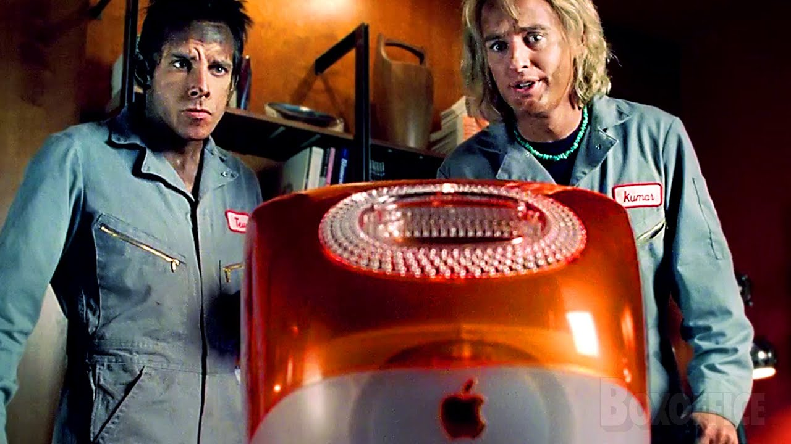

A central issue in copyright lawsuits against companies that produce generative-AI systems is the degree to which a generative-AI model does or does not "memorize" the data it was trained on. Unfortunately, the debate has been clouded by ambiguity over what "memorization" is, leading to legal debates in which participants often talk past one another.

In our forthcoming paper at Chicago-Kent Law Review, we attempt to bring clarity to the conversation over memorization and its relationship to copying that is cognizable by U.S. copyright law.^[When we began writing, we thought it would be quick work to pick up from where we left off in our prior work, [*Talkin’*](https://papers.ssrn.com/sol3/papers.cfm?abstract_id=4523551)—that there wasn’t much more to say than what we already did in that piece. 
The goal, it seemed, was to extract (bad  pun intended) our prior points in a short format, to make sure that they didn’t get lost in our very (very) long article about the supply chain. 
This made it a seemingly perfect fit for a symposium essay. 
But as with all things Generative AI, it turned out there was a web of complexity under the hood. 
We decided to take this complexity seriously—to address it carefully and head-on. 
Unfortunately, that means our short symposium piece is not so short]
In this blog post, we summarize the key takeaways of our new piece. 
The main point that we want to make clear is that, when a model memorizes some of its training data, those training data **are in the model**: they are copies that copyright law cares about, meaning that models are copies (in the copyright sense) of those training data. 
This doesn’t mean that these copies are infringing. 
We take no position on that in general, nor specifically with respect to current lawsuits: doing so would involve a lot of questions that are out of our wheelhouse—things that courts will need to decide. 
Our goal is merely to describe how these systems work so that copyright scholars can develop their theories of Generative AI on a firm technical foundation. 
We seek clarity, precision, and technical accuracy.

>**Matilda**: Did you find the files?  
>**Hansel**: I don't even know what they—what do they look like? 
>**Matilda**: They're in the computer. 
> **Hansel**: They're in the computer? 
>**Matilda**: Yes, they're definitely in there, I just don't know how he labeled them. 
>**Hansel**: I got it. IN the computer. It's so simple.

<figure style="text-align:center" id="fig:zoolander">
  
  <figcaption>**Figure 1**: A screenshot from the movie *Zoolander*, where Hansel and Derek are  looking at an iMac computer, apparently confused by Matilda’s claim that there are files *in* the computer. Quote and screenshot from *Zoolander* (Paramount Pictures 2001)</figcaption>
</figure>

The week between Christmas and New Year's Eve is usually a slow news week, but not in 2023, the year that [ChatGPT ate the world](https://chatgptiseatingtheworld.com/).
On December 27, *The New York Times* filed a massive copyright-infringement lawsuit against Microsoft and OpenAI, alleging that Bing Copilot and ChatGPT constituted ``massive copyright infringement.''^[Complaint at ¶ 74, N.Y. Times Co. v. Microsoft, No. 2:24-cv-00711 (C.D. Cal. Dec. 27,
2023).] 
In particular, the *Times* alleged that the generative-AI models in these systems had "memorized" large quantities of *Times* articles.
When prompted with some prefix of text from a *Times* article,^[The prompts ranged in length from a sentence to several paragraphs. See Exhibit J.] ChatGPT would output a lengthy, corresponding suffix that copied passages from the article—hundreds of words, varying only in a few scattered portions.^[We are deliberately providing only a high-level intuition for the type of memorization with which we engage in our paper, and we do so by drawing on an example from a current lawsuit. We provide more rigorous definitions of memorization in Part III.A of our longer paper.]
(See Figure [2](#fig:nyt).)

<figure style="text-align:center" id="fig:nyt">
  
  <figcaption>**Figure 1:** Memorized output from ChatGPT's GPT-4 endpoint (left) of a *New York Times* article (right)</figcaption>
</figure>

To the *Times* and its lawyers, these examples of "memorization" were blatant copyright infringement.
But to OpenAI and its defenders, there was nothing to see here.
OpenAI responded, both in court and online, that these examples were "adversarial, not normal usage patterns."
On this view, any copying (and thus any resulting  infringement) resulted from the prompts the *Times* used.
If the *Times* had not specifically manipulated ChatGPT into generating *Times* articles, there would have been no copying, and no copyright infringement.
As economist [Tyler Cowen put it](https://marginalrevolution.com/marginalrevolution/2023/12/toothpick-producers-violate-nyt-copyright.html), in mocking the *Times*'s argument, one could equally well say that a toothpick infringes:

>If you stare at just the exact right part of the toothpick, and measure the length from the tip, expressed in terms of the appropriate unit and converted into binary, and then translated into English, you can find any message you want.  You just have to pinpoint your gaze very very exactly (I call this "a prompt").
>
>In fact, on your toothpick you can find the lead article from today's *New York Times*.  With enough squinting, measuring, and translating.
>
>By producing the toothpick, they put the message there and thus they gave you NYT access, even though you are not a paid subscriber.  You simply need to know how to stare (and translate), or in other words how to prompt.
>
>So let’s sue the toothpick company!

Implicit in this view is that memorization and the copying it involves take place only at *generation time*: when a generative-AI system responds to a user's prompt with an output.
The system itself is a neutral, general-purpose tool.
Some users may use it to infringe, but other users will not.

This view treats the machine-learned model (or models) at the heart of a generative-AI system as a black box.
Training data is used to design and construct the box, but the box itself contains only abstracted statistical patterns of the training data.
Those patterns either contain no expression at all, or if they do, they are represented in a way that is fundamentally uninterpretable.
The box is a machine that transforms prompts into outputs.
Thus, if there is infringing expression in the output, it must be because the user prompted it in a targeted (i.e., "adversarial" or "abnormal") way to elicit that infringement.

This view refuses to consider what happens inside the box—the specifics of *how* statistical learning about the training data enables generative-AI systems to do what they do.
It avoids engaging with the actual representation of information about training data in a model's parameters.
In legal writing, this has involved gesturing at these representations with high-level terms like "features," "patterns," or "statistical correlations."
These terms suggest that while there may be some underlying math going on, the details can be sidestepped for simplicity, because they are irrelevant to the legal treatment of Generative AI.

This way of thinking about memorization^[For now, we continue to limit our use of the term "memorization" to the intuition provided in the (near-)verbatim copying demonstrated in Figure [2](#fig:nyt).] has significant copyright consequences.
It suggests that memorization is primarily about *prompting* rather than *training*.
Outputs may contain infringing expression, but the model that generates them does not.
A model itself is a neutral tool, equally good at producing infringing and non-infringing outputs.
It follows that users bear most or all of the responsibility for misusing a generative-AI system to elicit memorized content, and the creators of the system in which the model is deployed bear little or none.^[The distinction between a *model* and the larger *system* in which it is embedded is important to keep in mind. We discuss the technical difference in Part II.B and the legal consequences in Part III.H of the full paper.] 

With respect, we believe that this approach to making sense of memorization misdescribes how generative-AI  systems work. 
If a generative-AI model memorizes its training data, the training data is *in the model*.
This should not be surprising.
Models are not inert tools that have no relationship with their training data.
The power of a model is precisely that it encodes relevant features of the training data in a way that enables prompting to generate outputs that are based on the training data.
This is why capital-G Generative AI is such a big deal.
All useful models learn something about their training data.
Memorization is simply a difference in degree: it is an encoded feature *in the model*; whether it is a desired feature or not is another matter entirely. 

It follows that memorization in Generative AI cannot be neatly confined to generation time—to how the system behaves when adversarial users provide adversarial prompts.
If a generative-AI model has memorized copyrighted works, the memorized aspects of those works are present *in the model itself*, not just in the model's  generated outputs.
The model can possibly generate copies of those works on demand for any user,^[With some probability.] not just for users who have a suitably nefarious intent.
The system's creator may have various options to limit infringing outputs—for example, by refusing to generate outputs for certain prompts, or by checking outputs against a database of copyrighted works before returning them to the user.
But one of these options is always to *change the model*: to train or retrain it in a way that attempts to limit the model's memorization of training data.
Whether this is trivially easy or impractically hard depends on the details of the model architecture, the choice of training data, the training algorithm, and much more.
But the model's internals must always be part of the technical picture, because they are highly relevant to what a model has memorized and what it can do.

In the longer paper, we take no position on what the most appropriate copyright regimes for generative-AI systems should be, and we express no opinion on how pending copyright lawsuits should be decided.
These cases raise difficult doctrinal issues that run almost the entire gamut of copyright law, which we address in detail in [*Talkin’*](https://papers.ssrn.com/sol3/papers.cfm?abstract_id=4523551). 
Our goal is merely to describe how these systems work so that copyright scholars can develop their theories of Generative AI on a firm technical foundation.
We focus on a few threshold issues—particularly the Copyright Act's definition of  "copies"—where the technical details are particularly salient.
We seek clarity, precision, and technical accuracy.

Along these lines, in Part II of our article, we provide some brief, level-setting background on how generative-AI models work, and the systems and supply chains within which they are embedded. 
For much more detail on this topic, please refer to Part I of [our prior work on the generative-AI supply chain](https://papers.ssrn.com/sol3/papers.cfm?abstract_id=4523551). 

In Part III, the heart of the paper, we describe how to think clearly about memorization in generative-AI systems, and show how several common arguments about copyright and Generative AI are built on a mistaken view of what memorization consists of and how it is surfaced to end users.
In brief: 

- We begin in Part III.A by defining *memorization* and distinguishing it from related terms: *regurgitation*,  *extraction*, and *reconstruction*.
  Even the initial step of clarifying definitions has important implications.
  In particular, generation-time regurgitation implies that memorization has taken place during the training process.

- Next, in Part III.B we discuss in detail how memorized training data is within models in terms of the ``pattern’’ that models learn during training. 
  Here, we engage with copyright law, and show that memorization in a model constitutes a "reproduction" of the memorized data.

- Part III.C uses this understanding of memorization to explore two common metaphors for how generative-AI models work: that they learn only "patterns" in their training data and that they "compress" their training data. 
  Both metaphors have a kernel of truth, but neither should be taken as a guide for how a model works in all cases.

- From this basis, in Part III.D we dig into the state-of-the-art understanding of *how much* models memorize in practice.

- Of course, generative-AI models typically do more than just memorize their training data, so we bring in relevant details of learning and *generalization* in Part III.E.

- Then, we consider the implications of the fact that a generative-AI model both memorizes *and* generalizes. 
  In Part III.F, we consider the analogy between a generative-AI model and other "dual-use" technologies, such as VCRs (we discuss the *Sony* doctrine here). 
  In our view, the analogy fails in important ways; VCRs do not contain the works they can be used to infringe in the same way that memorizing models do.^[VCRs are not themselves copies of the tapes they produce, whereas models are copies of the training data they memorize. We are using the word "copy" in the way that U.S. copyright law means it, which differs from everyday use. We explain this further in the full paper.]

- In Part III.G, we return to the figure of the "adversarial" user invoked by defendants in current copyright lawsuits. 
  Not every user is adversarial, nevertheless, we argue that the users who are cannot simply be waved away as pesky exceptions.

- Finally, in Part III.H, we step back from models to look at system design.
Memorization in a model does not mean that a system necessarily has to produce copies of that memorized data in its generations; the model is just one of many pieces that system builders can adjust to tune the system’s overall outputs. 
There are several other places where system builders can attempt to limit how much
memorization gets surfaced to end users.

Part IV offers a brief conclusion, with some historical reflections.
We turn to comments made by computer scientist Allen Newell (a Turing Award winner and AI pioneer) nearly four decades ago. 
Newell warned legal scholars that they were building their theories about intellectual property and software on a foundation of sand:

> My point is precisely to the contrary. Regardless how the *Benson* case was decided—whether that algorithm or any other was held patentable or not patentable—confusion would have ensued. The confusions that bedevil algorithms and patentability arise from the basic conceptual models that we use to think about algorithms and their use.

His point was not that their policy arguments for and against IP protections were wrong: indeed, he expressed "no opinion" on the patentability of algorithms.^[Allen Newell, *Response: The Models Are Broken; The Models Are Broken*, 47 U. Pitt. L. Rev. 1023, 1023 (1986)] 
Instead, his point was far more fundamental: "The models we have for understanding the entire arena of the patentability of algorithms are inadequate—not just somewhat inadequate, but fundamentally so. They are broken."

Newell’s warning has renewed force today. 
Courts, regulators, and scholars who are grappling with how to apply existing laws to Generative
AI—or formulate new ones—must build their theories atop a foundation of conceptual models of how generative-AI systems work, with respect to memorization and much else. 
If they do not, faulty technical assumptions will lead to ungrounded legal claims—not necessarily wrong, but with no reliable connection to the underlying systems they purport to describe. 
They need, in short, a good model of models.
