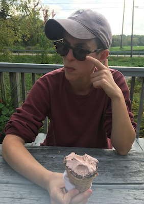

Progress in generative AI depends not only on better model
architectures, but on terabytes of scraped Flickr images, Wikipedia
pages, Stack Overflow answers, and websites. That is, generative models
ingest vast quantities of intellectual property (IP), which they can
memorize and regurgitate
verbatim[@extracting; @quantifying; @diffusion]. Several recently-filed
lawsuits relate such memorization to copyright
infringement[@midjourney; @feldman; @copilot; @stable-diffusion]. These
lawsuits will lead to policies and legal rulings that define our
ability, as ML researchers and practitioners, to acquire training data,
and our responsibilities towards data owners and curators. AI
researchers will increasingly operate in a legal environment that is
keenly interested in their work --- an environment that may require
future research into model architectures that conform to legal
requirements. As such, just as it is vital to inform courts and
policymakers of the realities of AI work, ICML attendees must be well
informed about law.

Our workshop will begin to build a comprehensive and precise synthesis
of the legal issues at play. Beyond IP, the workshop will also address
privacy and liability for dangerous, discriminatory, or misleading and
manipulative outputs. Addressing these challenges requires collaboration
between ML researchers and practitioners, data curators, HCI
researchers, and legal experts[@cooper2022accountabiliy]. We will mix
tutorial-style presentations from renowned experts in both ML and law
with panel discussions where researchers in both disciplines can engage
in semi-moderated conversation. We will solicit extended abstracts to
encourage a diverse range of scholars to attend and present their work
as posters and lightning talks. Based on enthusiasm and interest in
soliciting speakers and PC members, as well as the recent explosion of
general public interest in generative AI, we expect around 100 attendees
in person, and 50 virtually.

# Organizer Information {#organizer-information .unnumbered}

<!--   -->
<!--  -->
<!--  -->

    <figure>
  
  <figcaption>Ph.D. Candidate, Cornell University Department of
Computer Science\
`kate.lee168@gmail.com` [website](https://katelee168.github.io) [Google
Scholar](https://scholar.google.com/citations?user=bjdB4K8AAAAJ&hl=en)</figcaption>
</figure>
&nbsp; &nbsp; &nbsp; &nbsp;
  <!--  -->
  <figure >
  
  <figcaption>**A. Feder Cooper**, Ph.D. Candidate, Cornell University Department of
Computer Science\
`afc78@cornell.edu` [website](https://cacioepe.pe) [Google
Scholar](https://scholar.google.com/citations?hl=en&authuser=1&user=xjVV6xgAAAAJ)</figcaption>
</figure>

<!-- <figure >
  
   -->

<!-- Katherine's work has provided essential empirical evidence and measurement for grounding discussions around concerns that language models, like CoPilot, are infringing copyright, and about how language models can respect an individuals' right to privacy and control of their data. Additionally, she has proposed methods of reducing memorization. Her work has received recognition at ACL and USENIX.  -->

<!-- Cooper studies how to align the use of AI/ML with broader public values, and has published numerous papers at top ML conferences, interdisciplinary computing venues, and tech law review journals. Much of this work has been recognized with spotlight and contributed talk awards. Cooper has also been recognized as a Rising Star in EECS (MIT, 2021). Since 2020, Cooper has been the Ph.D. student organizer for the MacArthur-funded Artificial Intelligence Policy and Practice initiative at Cornell, an interdisciplinary working group that studies the technical, social, and legal implications of AI technology.\ -->

<!--**Fatemehsadat Mireshghallah**, Ph.D. Candidate, UC San Diego Computer
Science and Engineering Department\
`f.mireshghallah@gmail.com`
[website](https://cseweb.ucsd.edu/~fmireshg/) [Google
Scholar](https://scholar.google.com/citations?user=WUCu45YAAAAJ&hl=en&authuser=2)

Fatemeh's research aims at understanding learning and memorization
patterns in large language models, probing these models for safety
issues (such as bias), and providing tools to limit their leakage of
private information. She is a recipient of the National Center for Women
& IT (NCWIT) Collegiate award in 2020 for her work on privacy-preserving
inference, a finalist for the Qualcomm Innovation Fellowship in 2021,
and a recipient of the 2022 Rising Star in Adversarial ML award. She was
a co-chair of the NAACL 2022 conference and has been a co-organizer for
numerous successful workshops, including Distributed and Private ML
(DPML) at ICLR 2021, Federated Learning for NLP (FL4NLP) at ACL 2022,
Private NLP at NAACL 2022 and Widening NLP at EMNLP 2021 and 2022.\

**James Grimmelmann**, Tessler Family Professor of Digital and
Information Law\
`james.grimmelmann@cornell.edu` [website](https://james.grimmelmann.net)
[Google Scholar](https://scholar.google.com/citations?user=u3QxA40AAAAJ)

James Grimmelmann is the Tessler Family Professor of Digital and
Information Law at Cornell Tech and Cornell Law School. He studies how
laws regulating software affect freedom, wealth, and power. He helps
lawyers and technologists understand each other, applying ideas from
computer science to problems in law and vice versa. He is the author of
the casebook Internet Law: Cases and Problems and of over fifty
scholarly articles and essays on digital copyright, content moderation,
search engine regulation, online governance, privacy on social networks,
and other topics in computer and Internet law. He organized the D is for
Digitize conference in 2009 on the copyright litigation over the Google
Book Search project, the In re Books conference in 2012 on the legal and
cultural future of books in the digital age, and the Speed conference in
2018 on the implications of radical technology-induced acceleration for
law, society, and policy.\

**David Mimno** Associate Professor, Cornell University department of
Information Science\
`mimno@cornell.edu` [website](https://mimno.infosci.cornell.edu/)
[Google
Scholar](https://scholar.google.com/citations?user=uBFV6SUAAAAJ&hl=en)

David Mimno builds models and methodologies that empower researchers
outside NLP to use language technology. He was general chair of the 2022
Text As Data conference at Cornell Tech and organized a workshop on
topic models at NeurIPS. His work spans from education to the
development of advanced new language technology driven by the needs of
non-expert users. He is chief developer of the popular Mallet toolkit
and is currently co-PI on the NEH-sponsored BERT for Humanists project.
His work has been supported by the Sloan foundation and NSF.\

**Deep Ganguli** Research Scientist, Anthropic\
`deep@anthropic.com.edu`
[website](https://www.linkedin.com/in/dganguli/) [Google
Scholar](https://scholar.google.com/citations?user=rG3xW3UAAAAJ&hl=en)

Deep Ganguli leads the Societal Impacts team at Anthropic, which designs
experiments to measure both the capabilities and harms of large language
models. He is on the program committee at FAccT '23, and was formerly
the Research Director at the Stanford Institute for Human Centered AI
where he designed several successful and well-attended multidisciplinary
workshops aimed to bridge the gap between technologists and humanists.
Prior to this he was a Science Program Officer at the Chan Zuckerberg
initiative, where he designed numerous workshops and conferences aimed
to bring together software engineers and neuroscientists to address
pressing questions about neurodegenerative diseases.
 -->