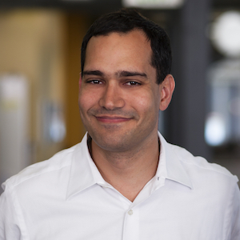
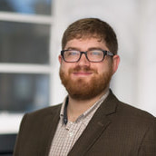
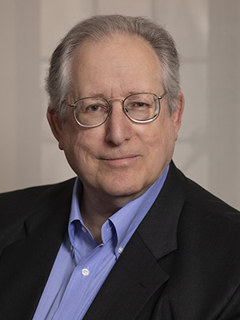
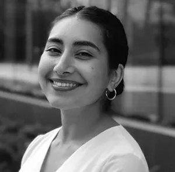
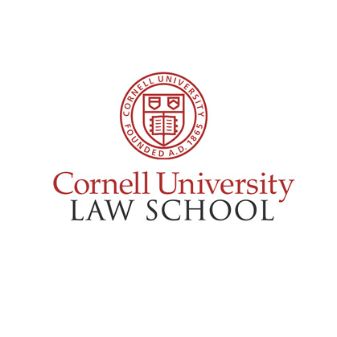

We are very excited to announce the inaugural Workshop on Generative AI and Law (GenLaw '23)! Please join us in Honolulu, Hawai'i at [ICML '23](https://icml.cc/), where we'll be bringing together experts in privacy, ML, policy, and law to discuss the intellectual property (IP) and privacy challenges that generative AI raises.

Read our introductory, explainers [here](explainers/index.html) on the copyright issues generative AI raises. 

<figure>
    
  </figure>

<!-- ### Dates: -->

<table class="dates">
  <tr>
    <td>
Workshop date:
</td>
    <td class="time">
<time datetime="2023-07">29 July 2023 (Ballroom B)</time>

  
[Livestream](https://www.youtube.com/watch?v=5j4U2UzJWfI) 

  
[Liveblog](https://3d.laboratorium.net/2023-07-29-genlaw)

  
"Talkin' 'Bout AI Generation: Copyright and the Generative-AI Supply Chain". July 2023. (to appear, Journal of the Copyright Society) [[ssrn](https://papers.ssrn.com/sol3/papers.cfm?abstract_id=4523551)][[blog](https://genlaw.github.io/explainers/talkin.html)]

  </tr>
</table>

### About GenLaw

Progress in generative AI depends not only on better model architectures, but on terabytes of scraped Flickr images, Wikipedia pages, Stack Overflow answers, and websites. 
But generative models ingest vast quantities of intellectual property (IP), which they can memorize and regurgitate verbatim. Several recently-filed lawsuits relate such memorization to copyright infringement. 
These lawsuits will lead to policies and legal rulings that define our ability, as ML researchers and practitioners, to acquire training data, and our responsibilities towards data owners and curators. 

AI researchers will increasingly operate in a legal environment that is keenly interested in their work --- an environment that may require future research into model architectures that conform to legal requirements. 
Understanding the law and contributing to its development will enable us to create safer, better, and practically useful models.
<!-- Addressing these challenges requires collaboration between ML researchers and practitioners, data curators, HCI researchers, and legal experts[@cooper2022accountabiliy]. -->

### Our Workshop

We're excited to share a series of tutorials from [renowned experts](index.html#speakers) in both ML and law and panel discussions, where researchers in both disciplines can engage in semi-moderated conversation. 

Our workshop will begin to build a comprehensive and precise synthesis of the legal issues at play. Beyond IP, the workshop will also address privacy and liability for dangerous, discriminatory, or misleading and manipulative outputs. It will take place on 29 July 2023, in Ballroom B. 

## Schedule

**Virtual poster session**: 28 July 2023 on [Gather Town](https://app.gather.town/app/iwrwqzVQw3d6zjKk/GenLaw%20Poster%20Session) at 8 am HT or 2 pm ET

|       |       |    |                                                                                |
|-------|-------|----|------------------------------------------------------------------------------------------|
|  9:00 |  9:15 | am | **Welcome** [Organizers](#organizer-information)
|  9:15 |  9:45 | am | **"Some Nonobvious Observation About Copyright’s Scope For Generative AI Developers"** [Pamela Samuelson](https://www.law.berkeley.edu/our-faculty/faculty-profiles/pamela-samuelson/#tab_profile)                                                                            |
|  9:45 | 10:05 | am | **"Is Training AI Copyright Infringement?"** [Mark Lemley](https://law.stanford.edu/directory/mark-a-lemley/)                                                                              |
| 10:05 | 10:40 | am | _Coffee_                                                                               
| 10:40 | 11:00 | am | **"Where and when does the law fit into AI development and deployment?"** [Miles Brundage](https://www.milesbrundage.com/)                                                                       |
| 11:00 | 12:00 | pm | **Panel on Intellectual Property** [Pamela Samuelson](https://www.law.berkeley.edu/our-faculty/faculty-profiles/pamela-samuelson/#tab_profile), [Mark Lemley](https://law.stanford.edu/directory/mark-a-lemley/), [Luis Villa](https://lu.is/), [Katherine Lee](https://katelee168.github.io) (Moderated by [Jack Balkin](https://jackbalkin.yale.edu/) and [A. Feder Cooper](https://afedercooper.info/)) |
| 12:00 |  1:30 | pm | _Lunch_                                                                                  |
|  1:30 |  1:45 | pm | **"Artificial Intelligence and the First amendment"** [Jack Balkin](https://jackbalkin.yale.edu/)                                                                              |
|  1:45 |  2:15 | pm | **Spotlights**                                                                               |
|  2:15 |  3:00 | pm | **Posters**                                                                                  |
|  3:00 |  3:30 | pm | _Coffee_                                                                                    |
|  3:30 |  3:45 | pm | **"A Brief Introduction to Machine Learning & Memorization"** [Nicholas Carlini](https://nicholas.carlini.com/)                                                                        |
|  3:45 |  4:00 | pm | **"What does Differential Privacy have to do with Copyright?"** [Gautam Kamath](http://www.gautamkamath.com/)                                                                       |
|  4:00 |  5:00 | pm | **Panel on Privacy** [Kristen Vaccaro](http://kvaccaro.com/), [Nicholas Carlini](https://nicholas.carlini.com/), [Miles Brundage](https://www.milesbrundage.com/), [Gautam Kamath](http://www.gautamkamath.com/), and [Jack Balkin](https://jackbalkin.yale.edu/) (Moderated by [Katherine Lee](https://katelee168.github.io) and [Deep Ganguli](https://www.linkedin.com/in/dganguli)) |

_Times refer to local time. (HT, UTC-10:00)_

## Speakers, Panelists & Moderators {.underlined}

<section id="organizer-list">
  <figure>
    
    <figcaption>
      
Pamela Samuelson

      

        Distinguished Professor of Law and Information
        University of California, Berkeley
      

      

        <a class="website" href="https://www.law.berkeley.edu/our-faculty/faculty-profiles/pamela-samuelson/#tab_profile">Website</a>
      

    </figcaption>
  </figure>

  <figure>
    
    <figcaption>
      
Mark Lemley

      

        Professor of Law
        Stanford Law School
      

      

        <a class="button-a" href="https://law.stanford.edu/directory/mark-a-lemley/">Website</a>
      

    </figcaption>
  </figure>

  <figure>
    
    <figcaption>
      
Nicholas Carlini

      

        Research Scientist
        Google Brain
      

      

        <a class="button-a" href="https://nicholas.carlini.com/">Website</a>
      

    </figcaption>
  </figure>

  <figure>
    
    <figcaption>
      
Gautam Kamath

      

        Assistant Professor
        University of Waterloo
      

      

        <a class="button-a" href="http://www.gautamkamath.com/">Website</a>
      

    </figcaption>
  </figure>

  <figure>
    
    <figcaption>
      
Kristen Vaccaro

      

        Assistant Professor
        University of California, San Diego
      

      

        <a class="button-a" href="http://kvaccaro.com/">Website</a>
      

    </figcaption>
  </figure>

  <figure>
    
    <figcaption>
      
Luis Villa

      

        Co-founder and General Counsel
        Tidelift
      

      

        <a class="button-a" href="https://lu.is/">Website</a>
      

    </figcaption>
  </figure>

  <figure>
    
    <figcaption>
      
Miles Brundage

      

        Head of Policy Research
        OpenAI
      

      

        <a class="button-a" href="https://www.milesbrundage.com/">Website</a>
      

    </figcaption>
  </figure>

  <figure>
    
    <figcaption>
      
Jack M. Balkin

      

        Professor
        Yale Law School
      

      

        <a class="button-a" href="https://jackbalkin.yale.edu/">Website</a>
      

    </figcaption>
  </figure>
</section>

## Organizer Information {#organizer-information .unnumbered .underlined}

<section id="organizer-list">
  <figure>
    
    <figcaption>
      
Katherine Lee

      

        Ph.D. Candidate
        Cornell University Department of Computer Science
      

      <a class="email" href="mailto:kate.lee168@gmail.com">kate.lee168@gmail.com</a>
      

        <a class="website" href="https://katelee168.github.io">Website</a>
        <a class="publications" href="https://scholar.google.com/citations?user=bjdB4K8AAAAJ">Google Scholar</a>
      

      

        Katherine's work has provided essential empirical evidence and measurement for grounding discussions around
        concerns that language models, like CoPilot, are infringing copyright, and about how language models can respect
        an individuals' right to privacy and control of their data. Additionally, she has proposed methods of reducing
        memorization. Her work has received recognition at ACL and USENIX.
      

    </figcaption>
  </figure>

  <figure>
    
    <figcaption>
      
A. Feder Cooper

      

        Ph.D. Candidate
        Cornell University Department of Computer Science
      

      <a class="email" href="mailto:afc78@cornell.edu">afc78@cornell.edu</a>
      

        <a class="website" href="https://afedercooper.info/">Website</a>
        <a class="publications" href="https://scholar.google.com/citations?user=xjVV6xgAAAAJ">Google Scholar</a>
      

      

        Cooper studies how to make more reliable conclusions when using ML methods in practice. This work has thus-far focused on empirically motivated, theoretically grounded problems in Bayesian inference, model selection, and deep learning. Cooper has published numerous papers at top ML conferences, interdisciplinary computing venues, and tech law journals. Much of this work has been recognized with spotlight and contributed talk awards. Cooper has also been recognized as a Rising Star in EECS (MIT, 2021).
      

    </figcaption>
  </figure>

  <figure>
    
    <figcaption>
      
Niloofar Mireshghallah

      

        Post-Doctoral Researcher
        University of Washington, Paul G. Allen Center for Computer Science and Engineering
      

      <a class="email" href="mailto:niloofar@cs.washington.edu">niloofar@cs.washington.edu</a>
      

        <a class="website" href="https://cseweb.ucsd.edu/~fmireshg/">Website</a>
        <a class="publications" href="https://scholar.google.com/citations?user=WUCu45YAAAAJ">Google Scholar</a>
      

      

        Niloofar's research aims at understanding learning and memorization
        patterns in large language models, probing these models for safety
        issues (such as bias), and providing tools to limit their leakage of
        private information. She is a recipient of the National Center for Women
        & IT (NCWIT) Collegiate award in 2020 for her work on privacy-preserving
        inference, a finalist for the Qualcomm Innovation Fellowship in 2021,
        and a recipient of the 2022 Rising Star in Adversarial ML award. She was
        a co-chair of the NAACL 2022 conference and has been a co-organizer for
        numerous successful workshops, including Distributed and Private ML
        (DpmL) at ICLR 2021, Federated Learning for NLP (FL4NLP) at ACL 2022,
        Private NLP at NAACL 2022 and Widening NLP at EMNLP 2021 and 2022
      

    </figcaption>
  </figure>

  <figure>
    
    <figcaption>
      
Madiha Z. Choksi

      

        Ph.D. Student
         Cornell University Department of Information Science
      

      <a class="email" href="mailto:mc2376@cornell.edu">mc2376@cornell.edu</a>
      

        <a class="website" href="https://madihaz.com/">Website</a>
      

      

      

    </figcaption>
  </figure>

  <figure>
    
    <figcaption>
      
James Grimmelmann

      

        Professor of Digital and Information Law
        Cornell Law School and Cornell Tech
      

      <a class="email" href="mailto:james.grimmelmann@cornell.edu">james.grimmelmann@cornell.edu</a>
      

        <a class="website" href="https://james.grimmelmann.net">Website</a>
        <a class="publications" href="https://scholar.google.com/citations?user=u3QxA40AAAAJ">Google Scholar</a>
      

      

        James Grimmelmann is the Tessler Family Professor of Digital and
        Information Law at Cornell Tech and Cornell Law School. He studies how
        laws regulating software affect freedom, wealth, and power. He helps
        lawyers and technologists understand each other, applying ideas from
        computer science to problems in law and vice versa. He is the author of
        the casebook Internet Law: Cases and Problems and of over fifty
        scholarly articles and essays on digital copyright, content moderation,
        search engine regulation, online governance, privacy on social networks,
        and other topics in computer and Internet law. He organized the D is for
        Digitize conference in 2009 on the copyright litigation over the Google
        Book Search project, the In re Books conference in 2012 on the legal and
        cultural future of books in the digital age, and the Speed conference in
        2018 on the implications of radical technology-induced acceleration for
        law, society, and policy.
      

    </figcaption>
  </figure>

  <figure>
    
    <figcaption>
      
David Mimno

      

        Associate Professor
        Cornell University Department of Information Science
      

      <a class="email" href="mailto:mimno@cornell.edu">mimno@cornell.edu</a>
      

        <a class="website" href="https://mimno.infosci.cornell.edu">Website</a>
        <a class="publications" href="https://scholar.google.com/citations?user=uBFV6SUAAAAJ&hl=en">Google Scholar</a>
      

      

        David Mimno builds models and methodologies that empower researchers
        outside NLP to use language technology. He was general chair of the 2022
        Text As Data conference at Cornell Tech and organized a workshop on
        topic models at NeurIPS. His work spans from education to the
        development of advanced new language technology driven by the needs of
        non-expert users. He is chief developer of the popular Mallet toolkit
        and is currently co-PI on the NEH-sponsored BERT for Humanists project.
        His work has been supported by the Sloan foundation and NSF
      

    </figcaption>
  </figure>

  <figure>
    
    <figcaption>
      
Deep Ganguli

      

        Research Scientist
        Anthropic
      

      <a class="email" href="mailto:deep@anthropic.com">deep@anthropic.com</a>
      

        <a class="website" href="https://www.linkedin.com/in/dganguli">Website</a>
        <a class="publications" href="https://scholar.google.com/citations?user=rG3xW3UAAAAJ&hl=en">Google Scholar</a>
      

      

        Deep Ganguli leads the Societal Impacts team at Anthropic, which designs
        experiments to measure both the capabilities and harms of large language
        models. He is on the program committee at FAccT '23, and was formerly
        the Research Director at the Stanford Institute for Human Centered AI
        where he designed several successful and well-attended multidisciplinary
        workshops aimed to bridge the gap between technologists and humanists.
        Prior to this he was a Science Program Officer at the Chan Zuckerberg
        initiative, where he designed numerous workshops and conferences aimed
        to bring together software engineers and neuroscientists to address
        pressing questions about neurodegenerative diseases.
      

    </figcaption>
  </figure>

  <figure>
    
    <figcaption>
      
Ludwig Schubert

      

        <!-- Research Engineer -->
        <!-- formerly OpenAI, Google Brain, Stanford University -->
      

      <a class="email" href="mailto:ludwig@cs.stanford.edu">ludwig@cs.stanford.edu</a>
      

        <a class="website" href="https://schubert.io">Website</a>
        <a class="publications" href="https://scholar.google.com/citations?user=npQ1IpkAAAAJ&hl=en">Google Scholar</a>
      

      

    </figcaption>
  </figure>

</section>

### Contact us

Reach the organizers at: <a class="email" href="mailto:genlaw.org@gmail.com">genlaw.org@gmail.com</a>

Or, join our mailing list at: [genlaw@groups.google.com](https://groups.google.com/g/genlaw)

### GenLaw is grateful for support from the following sponsors and partners:

  
  
  
  
  
  
  

